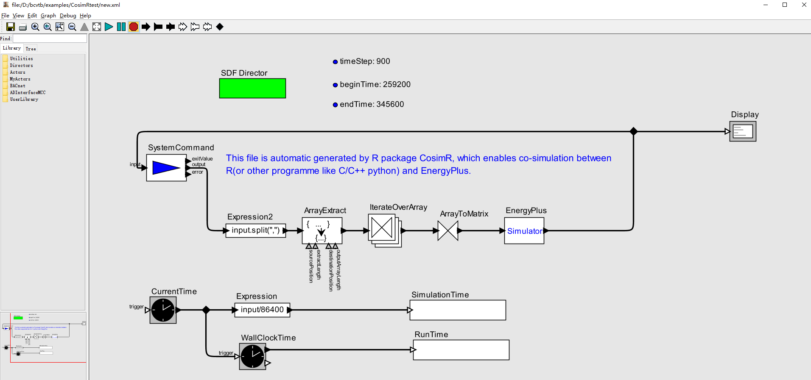
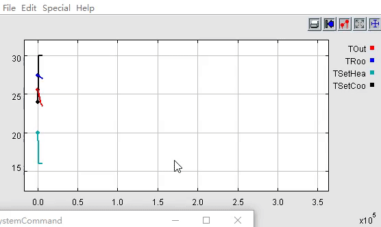

```{r setup, include=FALSE}
knitr::opts_chunk$set(echo = TRUE,eval = FALSE)
```


> Generate,modify and save the xml file for co-simualtion between external program (R,python or C/C++) and EnergyPlus through the BCVTB

CosimR provides the minimum implementation for co-simulation between external program (R,python or C/C++) and EnergyPlus through the SystemCommand Acotr of BCVTB. CosimR can help you to generate(copy), modify and save a xml file, which will be used in the co-simulation. Meanwhile, CosimR also provides a simple function to run the co-simulation through command line of BCVTB.




## Installation

You can install the development version of `CosimR` from Github by:

```{r}
devtools::install_github('jywang2016/CosimR')
```


## Features

Done:

- Generate,modify and save BCVTB xml file.
- Run BCVTB co-simuation based on command line.

Plan:

- Generate variables.cfg automatically.
- Check your IDF external interface with the corresponding parameters in xml file.

As for more diffcult operations, you need adjust your IDF and external scripts according to your needs.

## Usage

The flowchart:

```text

         Step1:Copy                    Step2:Modify         Step3:save/write            Step4: run
xml file =========>>> '.../CosimR.xml' =========>>>  xmlroot =========>>> '.../new.xml' =========>>> result
         copy_xml()                    modify_xml()           write_xml()               run_Cosim()
```

### reproduce the schedule example

We need prepare some files for co-simulation. All files have been placed in the package. Therefore, just copy them to your target path.

> Note: All the file.copy operations are not necessary for co-simulation if you already have your own idf, cfg, R or python script,and so on. These copy is just for the reproduction of schedule example which is provided in BCVTB. 

```{r,eval=TRUE}
library(CosimR)
```

```{r,echo=FALSE,eval=TRUE}
xmlpath <- 'D:/bcvtb/examples/CosimRtest'
```


```{r}
# This xmlpath is my case. Change it according to your need.
# The idf version is V8-5-0.
xmlpath <- 'D:/bcvtb/examples/CosimRtest'
file.copy(from = system.file("extdata/SmOffPSZ.idf", package = "CosimR"),
          to = xmlpath,
          overwrite = TRUE)
file.copy(from = system.file("extdata/variables.cfg", package = "CosimR"),
          to = xmlpath,
          overwrite = TRUE)
```

### Step1: Copy the xml

```{r,eval=TRUE}
copy_xml(xmlpath = xmlpath)
```

### Step2: Modify the xml

```{r,eval=TRUE}
xmlroot<- modify_xml(xmlpath = xmlpath,
                     timeStep = 15*60, # '15*60' is more recommended than 15*60
                     beginTime = 3*24*3600,
                     endTime = 4*24*3600,
                     extractLength = 2,
                     idf = paste0(xmlpath,'/SmOffPSZ.idf'),
                     epw = 'D:/bcvtb/examples/ePlusWeather/USA_IL_Chicago-OHare.Intl.AP.725300_TMY3.epw',
                     outname = 'eplusout',
                     programname = 'Rscript',
                     programArgs = 'Cosim.R',
                     workingDir = paste0(xmlpath,'/R'),
                     cpp = FALSE)
```

The `Cosim.R` is also included in the `CosimR` package. 

```{r}
file.copy(from = system.file("extdata/Cosim.R", package = "CosimR"),
          to = paste0(xmlpath,'/R'),
          overwrite = TRUE)
```

### Step3: write(save) your xml.file

```{r,eval=TRUE}
write_xml(rootnode = xmlroot,
          xmlpath = xmlpath,
          output = 'new.xml')
```

**Now, you can operate the new.xml by BCVTB.**

### Step4: run co-simulation (Optional)

```{r}
run_Cosim(bcvtbpath = 'D:/bcvtb',
          xmlpath = xmlpath,
          output = 'new.xml')
```

```
## Co-simulation ends. You can check the results inD:/bcvtb/examples/CosimRtest
```

## result

```{r gif, fig.cap = 'Results gif',fig.align='center', echo=FALSE,eval=TRUE}

```


## Python [optional]

You can use this part to replace above corresponding R code chunks.

```{r}
xmlroot<- modify_xml(xmlpath = xmlpath,
                     timeStep = 15*60, 
                     beginTime = 3*24*3600,
                     endTime = 4*24*3600,
                     extractLength = 2,
                     idf = paste0(xmlpath,'/SmOffPSZ.idf'),
                     epw = 'D:/bcvtb/examples/ePlusWeather/USA_IL_Chicago-OHare.Intl.AP.725300_TMY3.epw',
                     outname = 'eplusout',
                     programname = 'python',
                     programArgs = 'Cosim.py',
                     workingDir = paste0(xmlpath,'/python'),
                     cpp = FALSE)
file.copy(from = system.file("extdata/Cosim.py", package = "CosimR"),
          to = paste0(xmlpath,'/python'),
          overwrite = TRUE)
```

## C/C++ [optional]

Use this part to replace above corresponding code chunks.

```{r}
xmlroot<- modify_xml(xmlpath = xmlpath,
                     timeStep = 15*60,
                     beginTime = 3*24*3600,
                     endTime = 4*24*3600,
                     extractLength = 2,
                     idf = paste0(xmlpath,'/SmOffPSZ.idf'),
                     epw = 'D:/bcvtb/examples/ePlusWeather/USA_IL_Chicago-OHare.Intl.AP.725300_TMY3.epw',
                     outname = 'eplusout',
                     programname = 'D:/bcvtb/examples/CosimRtest/cpp/Cosim',
                     programArgs = '',
                     workingDir = paste0(xmlpath,'/cpp'),
                     cpp = TRUE)

#window user can use exe
#linux and other OS user can compile the Cosim.cpp
file.copy(from = system.file("extdata/Cosim.exe", package = "CosimR"),
          to = paste0(xmlpath,'/cpp'),
          overwrite = TRUE)
```

## Speed

Run co-simulation for one-day in my windows 10 x64 system:

```txt
exe(compiled by C++, 5.X secs) >  python(10.x secs) > R(28.x secs).
```
>Calling Rscript by SystemCommand spends much more time than python.

## Author

Jiangyu Wang

*School of Energy and Power Engineering, Huazhong University of Science and Technology*
